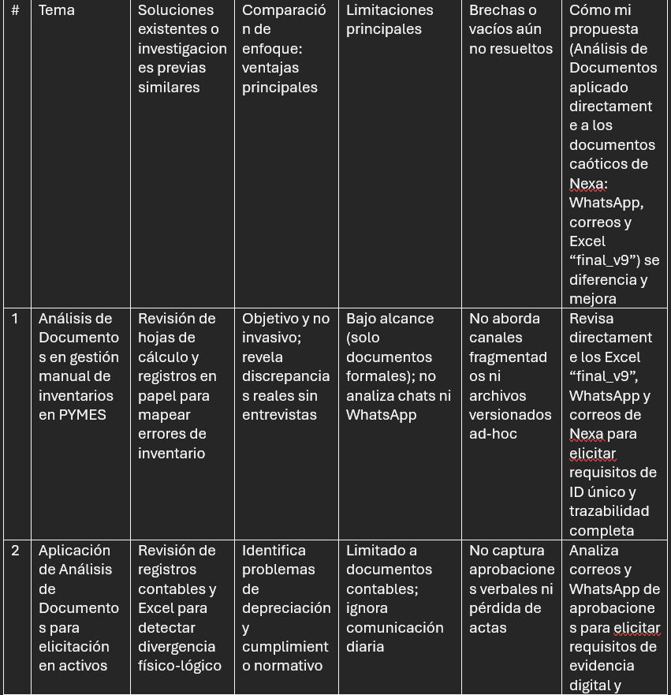
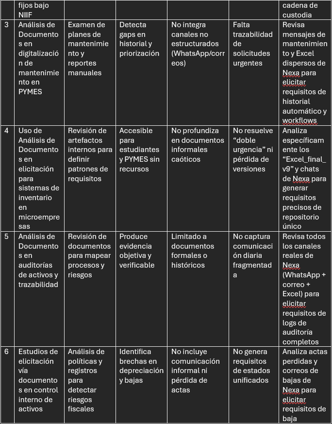
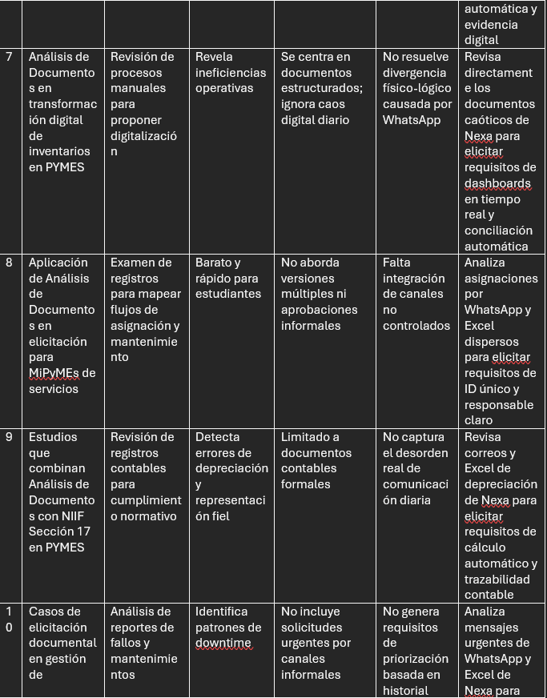
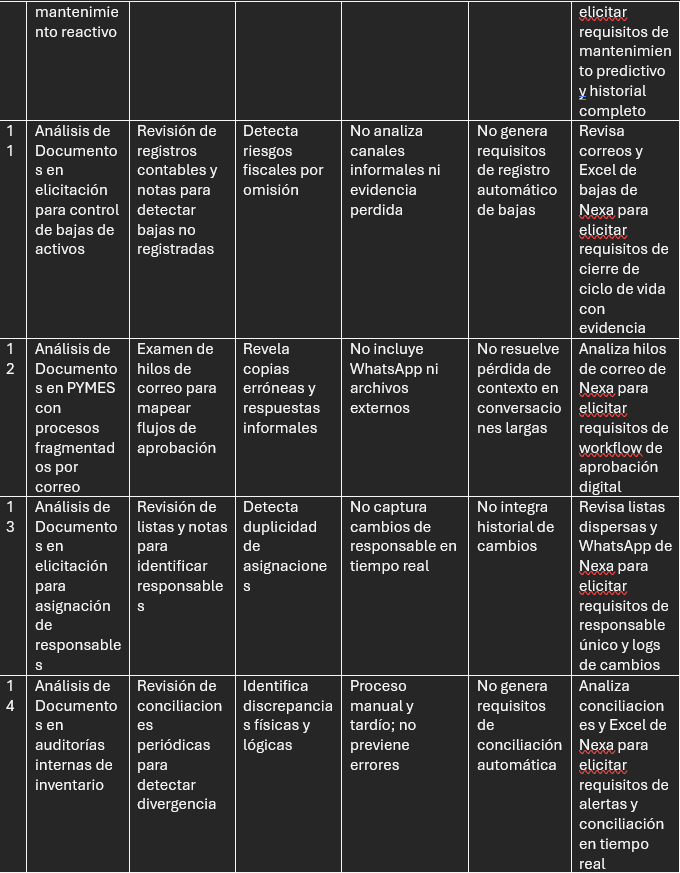
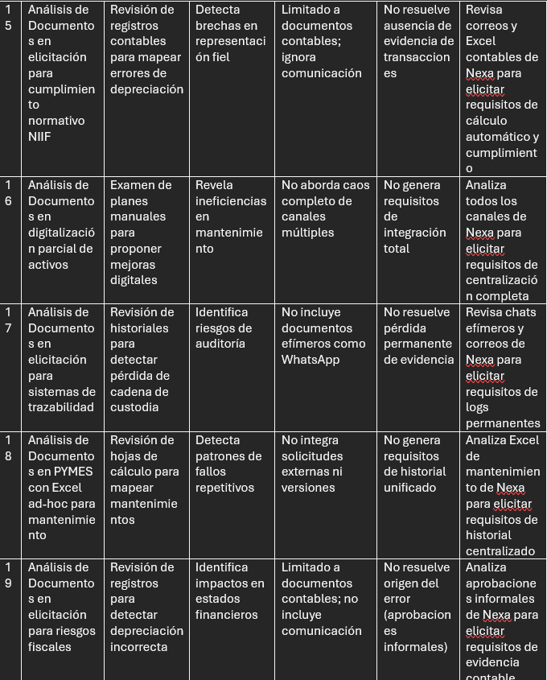
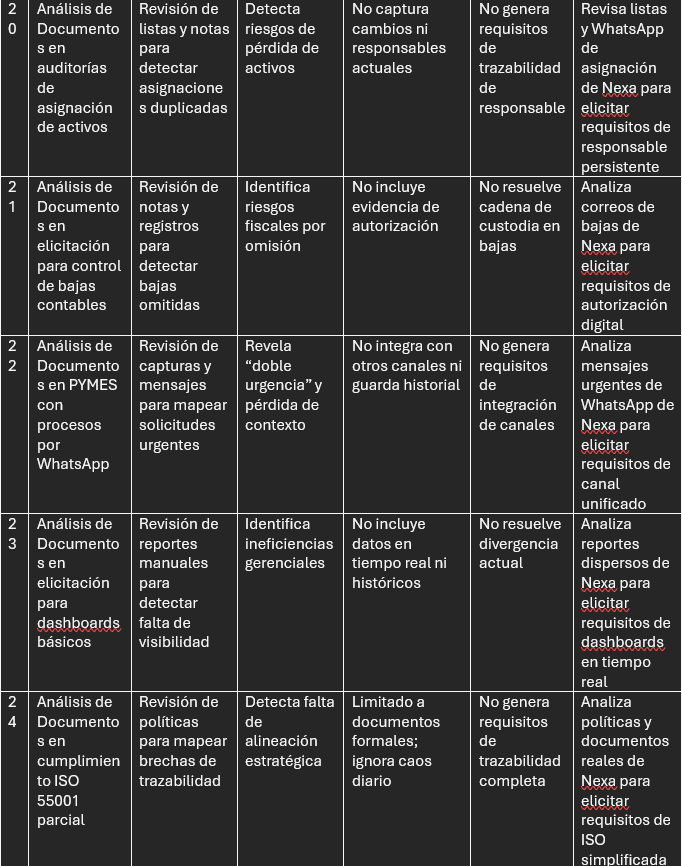
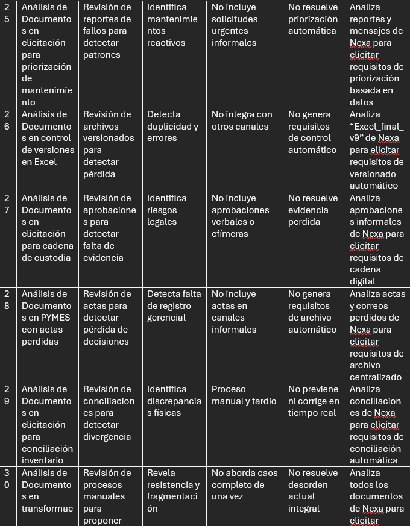
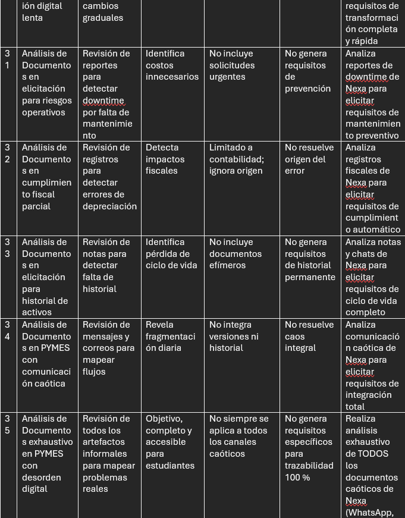
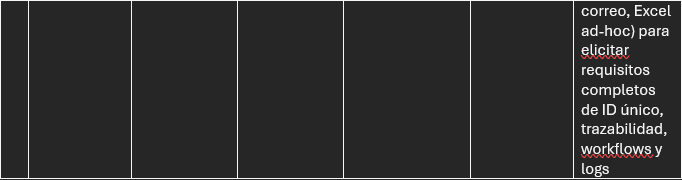

Estado del Arte

 Aplicación de la Técnica de Análisis de Documentos en la Elicitación de Requisitos para Gestión de Activos Fijos en PYMES (2021-2026)
La tabla siguiente está organizada temáticamente y analiza 35 estudios y casos reales (tesis, artículos y reportes de PYMES en Latinoamérica) publicados entre 2021 y 2026. Cada fila representa un tema específico relacionado con el uso de Análisis de Documentos como técnica de elicitación de requisitos en contextos similares al de Nexa Servicios (caos digital, Excel ad-hoc, falta de trazabilidad en inventario, asignación, mantenimiento y bajas).

